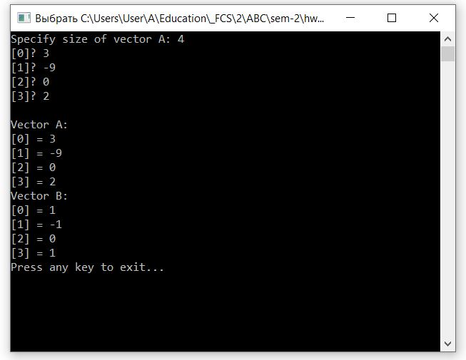
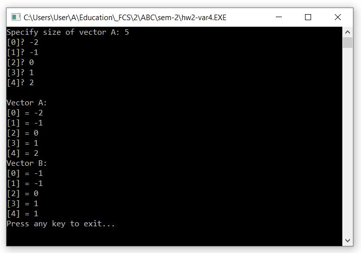
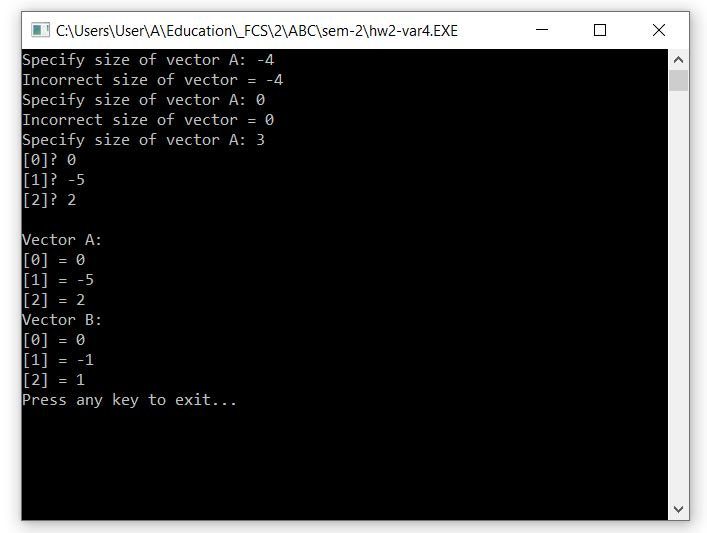
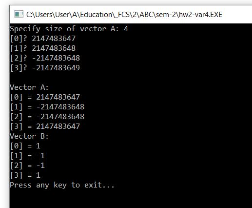

# HSE-ASM
Репозиторий с моими работами по предмету "Архитектура вычислительных систем"
## Беловицкий В.И. БПИ191

## Задание 2, Вариант 4
Ввести длину массива A, вести массив A, сформировать массив B, вывести оба массива. 
Массив B формируется по следующим правилам: 
B[i] = 1,  A[i]>0 
B[i] = -1, A[i]<0 
B[i] = 0,  A[i]=0 
Результаты работы программы: 
 
 

Был предусмотрен повторный ввод длины массива, если введенное значение было не положительным: 
 

Поскольку элементы массива имеют размер 4 байта, проведем эксперимент с переполнением: 
 
(0 и 2 элементы это intMax и intMin, 1 и 3 это intMax+1 и intMin-1)
